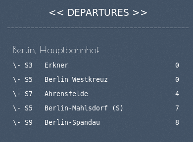

<h1> EFA_Conky </h1>

General:
-------
This conky provides you with the departure monitor of a linked station. The link exists between your Router-Mac adress. So the shown station data depends on where you are and you have the right station displayed at the right place without GPS use.

Setup & Configuration:
---------
1. To setup EFA-Conky just execute:  `./install.py`

2. To link a Station to your network: `efaconky add`
  (To find a Station id search on [this map](https://github.com/TheNewCivilian/EFA-MAP))

3. To start conky:  `efaconky start`

4. To remove all links to network:  `efaconky remove`

5. To preview conky output:  `efaconky preview`

Dependencies:
------------
You can use `./install.py all` to auto install dependencies.

Conky:  `sudo apt-get install conky`

Net-Tool: `sudo apt-get install net-tools`

Conkyutil: `pip install conkyutil`

Tinydb: `pip install tinydb`

Netifaces: `pip install netifaces`

Lxml: `pip install lxml`

Screenshots:
-----------

